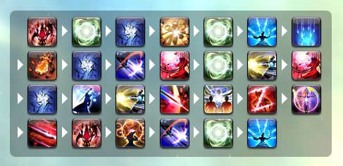
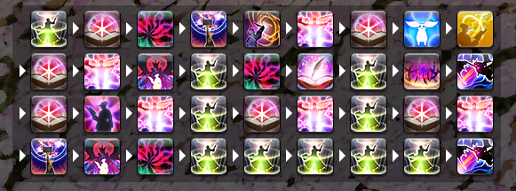

# ffxiv-opener-overlay

  

[ACT](https://advancedcombattracker.com/) [overlay](https://github.com/ngld/OverlayPlugin) for [Final Fantasy XIV](https://www.finalfantasyxiv.com/) that shows your real-time skill sequences.


<!--  -->

* Watch in-game video: [English](https://gaming.youtube.com/watch?v=mKNK5xdRwsE&feature=share) &middot; [Korean](https://gaming.youtube.com/watch?v=sLJddcK1z6Y&feature=share)

## Installation

```url
https://chalkpe.github.io/ffxiv-opener-overlay/
```

### OverlayPlugin

1. Open ACT
1. Plugins → OverlayPlugin.dll → `New`
1. Add new **Custom** preset, **MiniParse** type overlay (name is your choice)
1. Switch to the new overlay tab and set **URL** as above

### ACTWebSocket

1. Open ACT
1. Plugins → ACTWebSocket
1. Check **Using BeforeLogLineRead** on left panel
1. `Add URL` → set as above and select the new row → Click `Overlay`

## Requirements

### Supported clients

| Language | Patch |
| :--: | :--: |
| 日本語 (`jp`) | `6.08` |
| English (`en`) | `6.08` |
| Deutsch (`de`) | `6.08` |
| Français (`fr`) | `6.08` |
| 한국어 (`kr`) | `5.58` |

### In-game configuration

* (`jp`) キャラクターコンフィグ → チャットログ設定 → ログフィルター設定 → バトル → `自分からのアクションの開始/中断`
* (`en`) Character Configuration → Log Window Settings → Log Filters → Battle → `Actions initiated by you.`
* (`de`) Configuration personnage → Fenêtre de log → Filtres du log → Combat → `Vos actions`
* (`fr`) Charakterkonfiguration → Chatlog → Chatfilter → Kampfhandlungen → `Eigenes Kommando`
* (`kr`) 캐릭터 설정 → 대화창 설정 → 로그 필터 설정 → 전투 → `자신의 기술 시작 및 중단`

## Usage

### Commands

* `/e toggle` - show/hide overlay
* `/e reset` - reset current sequence
* `/e scale <number>` - scale entire overlay (default: `1`)

## Development

* [Job Actions data](src/assets/database.json) is automatically generated by [ffxiv-actions](https://github.com/ChalkPE/ffxiv-actions).
* The overlay must be working on Chrome 45 for compatibility. [I'm](https://github.com/hibiyasleep/OverlayPlugin/blob/master/Utils/build-cef.ps1) [happy](https://bitbucket.org/chromiumembedded/cef/commits/807de3c161f5598597e40f5a42e8541d9e3eb905).

### Local development

```bash
yarn && yarn serve
```

### Deploy to GitHub Pages

```bash
yarn build && yarn deploy
```

## Maintainers

| [Chalk Alt](https://twitter.com/chalk_alt) |
| :--: |
| [](https://na.finalfantasyxiv.com/lodestone/character/27400250/) |

## License

[MIT License](LICENSE)

### /src/assets

```text
© 2010 - 2022 SQUARE ENIX CO., LTD. All Rights Reserved.
```
